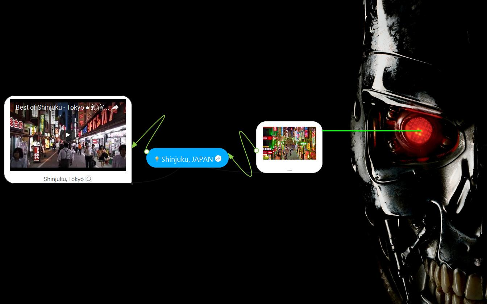
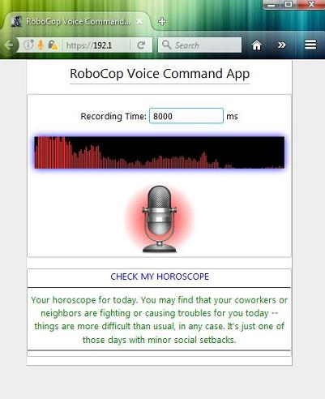
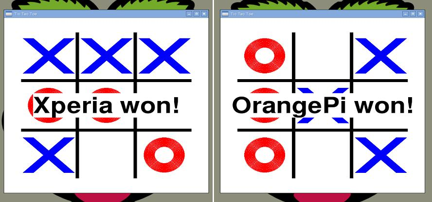
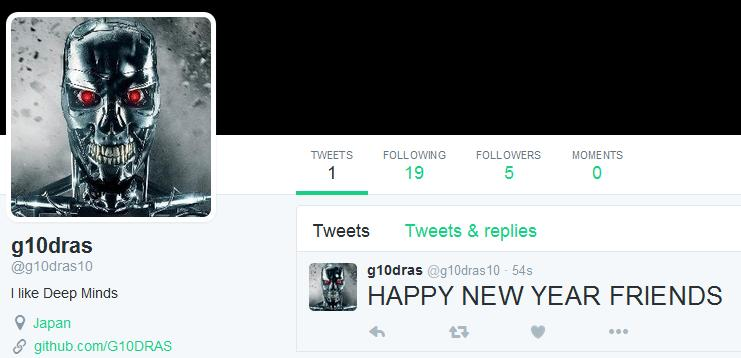
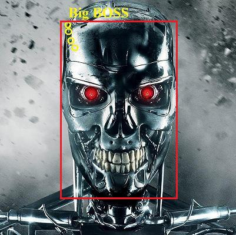

# RoboCop (ロボ警官)

[](https://www.codacy.com/app/g10dras/RoboCop?utm_source=github.com&amp;utm_medium=referral&amp;utm_content=G10DRAS/RoboCop&amp;utm_campaign=Badge_Grade)  [](https://coveralls.io/github/G10DRAS/RoboCop?branch=master) [](https://travis-ci.org/G10DRAS/RoboCop) [](https://requires.io/github/G10DRAS/RoboCop/requirements/?branch=master) [](https://github.com/G10DRAS/RoboCop/blob/master/LICENSE) [](https://github.com/G10DRAS/RoboCop) [](https://github.com/G10DRAS/RoboCop/issues?q=is%3Aopen+is%3Aissue) [](https://github.com/G10DRAS/RoboCop/pulls?q=is%3Aopen)

Artificially Intelligent Robot with Computer Vision, Natural Language Processing, Fuzzy Logics, Continuos Learning, Sense and Feelings.

コンピュータビジョンを考慮した人工知能ロボット, 自然言語処理、ファジー論理、継続学習、センスと感情。



|facebook|twitter|mpd|gmail|calendar|maps|weather|rss|slack|time|wiki|hue|
|:---:|:---:|:---:|:---:|:---:|:---:|:---:|:---:|:---:|:---:|:---:|:---:|
|||||||||||||

|classroom|dictionary|sudoku|math test|exchange|marksheet|openhab|spelling|sportnews|
|:---:|:---:|:---:|:---:|:---:|:---:|:---:|:---:|:---:|
||||||||||

|imdb|jokes|stockexch|technews|telegram|tictactoe|wolfram|tankbattle|facialexpression|
|:---:|:---:|:---:|:---:|:---:|:---:|:---:|:---:|:---:|
||||||||||

## Python Libraries:
[](https://requires.io/github/G10DRAS/RoboCop/requirements/?branch=master)

## Voice Interfaces to RoboCop:

|High Quality Microphone|Bluetooth Headset Support|Telegram Bot Interface (Voice + Text)|Facebook Messenger Bot Interface (Text)|
|:---:|:---:|:---:|:---:|
|||||

|Cross Plateform Desktop Browsers (Firefox, Chrome)|Android Mobile Browsers (Firefox, Chrome)|Android App|Webcam Interface|
|:---:|:---:|:---:|:---:|
|||||

## Security Features:

* Live Face Recognition.
* Speaker Diarization (Master's Voice).
* In-built Hotword Detection.
* Complete Offline Speech Recognition (Offline STT).
* Combination of Hand Gesture as passkey.

## Functionalities:

### Party Mode
* Load DJ mix playlist in automix and connect system to 7.1 channel music system.
* Set Home lights  to party mode.
* Load friends faces database and greet them on gate by recognizaing their faces.
* Change the song on demand.
* Voice operated coffee, beer machine.
* Hand Gesture Jukebox control (Play, Next, Stop....).
* Control Jukebox with various Glyphs (Next, Prev, Stop, Play....). 

### Home Security Mode
* Intrusion detection with Infrared Sensores.
* Motion detection with Night Vision Cameras.
* Controlled Pnumatic gun loaded with baseballs.
* Dial 100 facility. 
* Dial Ambulance if Intruder looks injured.

### Kids Engagement Mode (Robo Nanny)
* Tell the story by scanning pages from paper book.
* Play Rhymes of your choice. ("Play Wheel on the Bus")
* Detects kid's facial expression and play Rhymes accordingly. (experimental)
* Recognise Kids activity (playing, sleeping, crowling, seating....).
* Play picture game.
* Play math puzzles and check the answers.
* Play spelling bee game and check the spelling.
* Play Tank Game (Voice Commands)
* Play Tic Tc Toe (Voice Commands)
* Japanese Game Janken (じゃん拳)

### Spy Mode (Rocker)
* Wi-Fi (Network Scanning, Find Today's WiFi Password, etc.......) 
* Bluetooth (MAC Finder : Who is around | Is SHE Around)
* RFID (Scanning)
* NFC (NFC Automation)
* Kali Linux (Metasploit Payloads Automation) 

### Home Automation Mode
* OpenHAB
* Home-Assistance
* Domoticz
* Phillips Hue
* Pi controlled Relay

### General Mode
* Facebook (Birthday, Notification....)
* Twitter (Notification, Treands, Send Tweets)
* Telegram Bot (Telegram Updates)
* Slack Bot
* Wolfram Knowledge Engine.
* Check Horoscope for a Day.
* Internet Radio. (Jazz, Blue, Pop, Rock....)
* Check Product Info by reading barcodes.
* Google Calendar (Search, Events, Meetings, etc...)
* English, German, Spanish Jokes.
* World News, Local New, Sport News, Technology News.
* Translate one language to another.
* Play local music library. (Search, Song Name, Album, Random Choice)
* Currency Exchange Rate.
* Weather Forecast. (Today, Tommorow, Weekly)
* Take Selfie/Photo and send it to your email address as an attachment.
* Check Emails.
* Your Portfolio performance on NASDAQ.
* News about stocks in your Portfolio.
* Solve a sudoku puzzle by looking into paper cutting.
* Get movie info from IMDB database.
* Wikipedia Search.
* Dictionary Search.
* Take your photo and draw poster out of it and then print it.
* Voice driven Shopping Kart / Database queries. 

### Classroom Mode
* Scan the student faces and record attendance.
* Scan exam OMR sheets and create marksheet for student.
* Run a Knowledge Engine for students.
* Check the noise level in classroom and .... students.
* Provide assistance to Teacher.

### Chat Mode
* Chat with Santa.
* Chat with Alice in Wonderland
* Chat with CleverBot.
* Chat with DrumphBot.

### Super Market Helper Mode
* Show it a product, it will take a snapshot of product and try to locate it in the store, for you. (Awesome)


## Voice Controlled Games
* Tank Battle Game (FURRY). Destroy Enemy Tank by controlling your FURRY with your voice. //===--


* Tic Tac Toe



## Sudoku Solver
* Solve a Sudoku Puzzle by looking into paper cutting


## Jukebox Control with Glyphs


## Home Automation

|Turn ON First Floor Office Heating|Whats the Temperature at Ground Floor Kitchen        It is 18.4 degree celcius|
|:---:|:---:|
|||

## Send Twitts to Twitter
```sh
What would you like to tweet?
HAPPY NEW YEAR FRIENDS
```



## Animal Game for Kids
```sh
What you want to see
Show me a Eagle
This is a Eagle
```


## Spelling Test for Kids
```sh
tell me the spelling of elephant
E L E P H A N T
E L E P H A N T is elephant.. Correct Answer. Keep it up Baby..
```

## Live Face Recognization



## Draw Sketch and Poster


## Browser Based Configuration Interface

|Hotword Configuration|OpenHAB Home Automation|
|:---:|:---:|
|||
